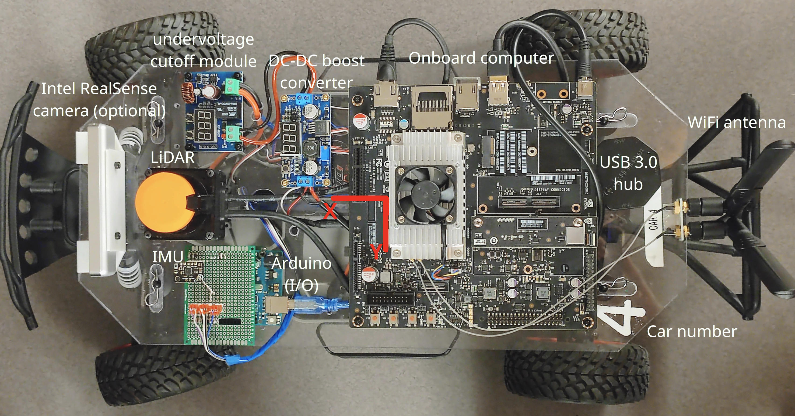
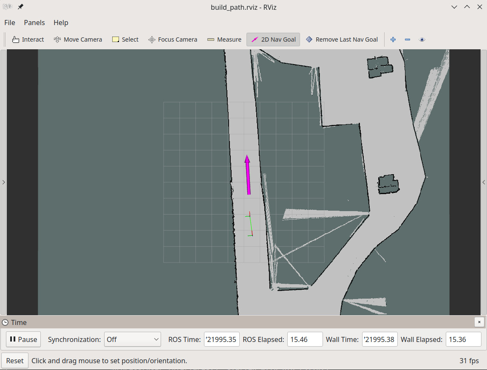
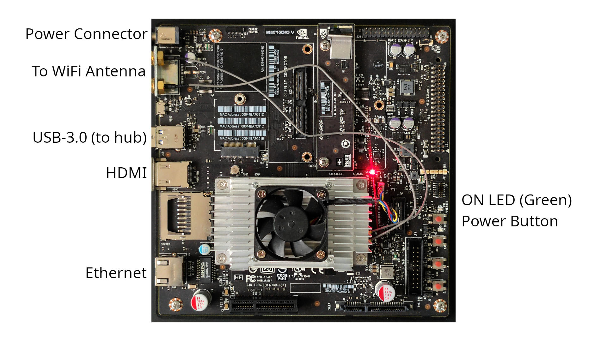
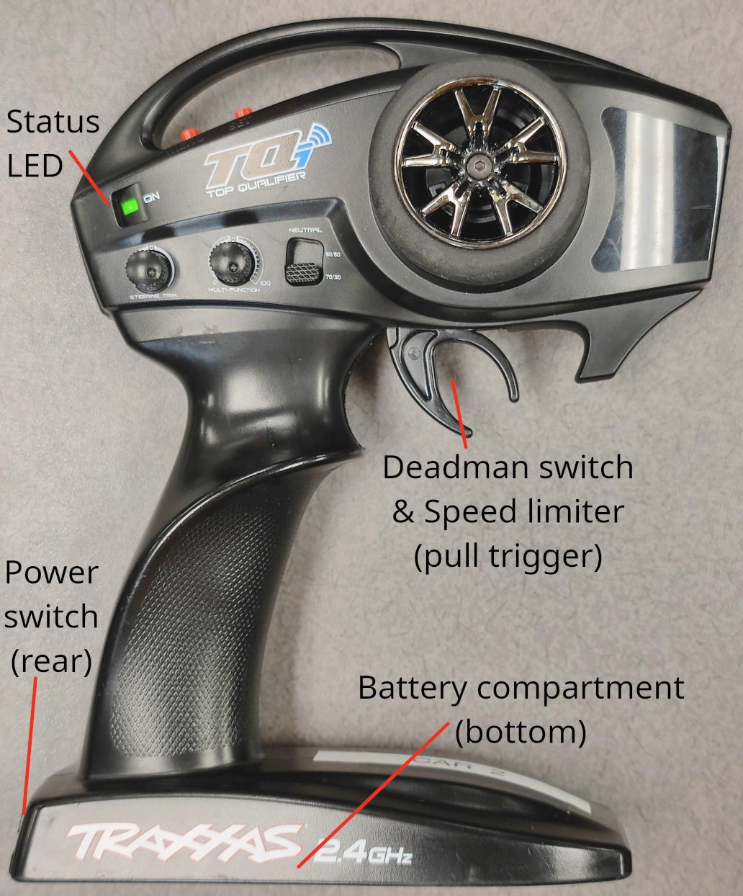
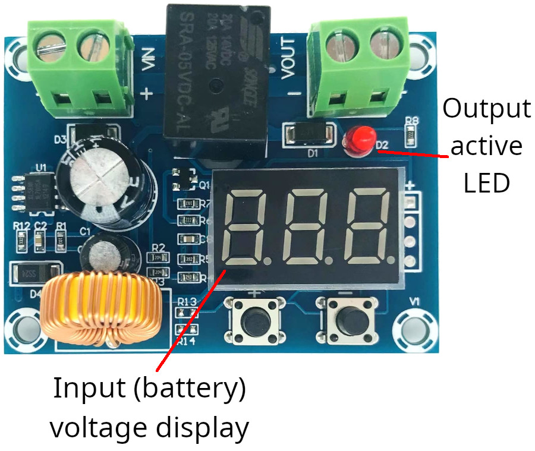
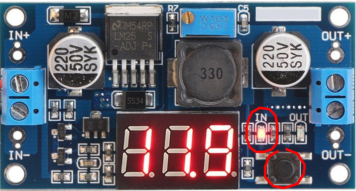
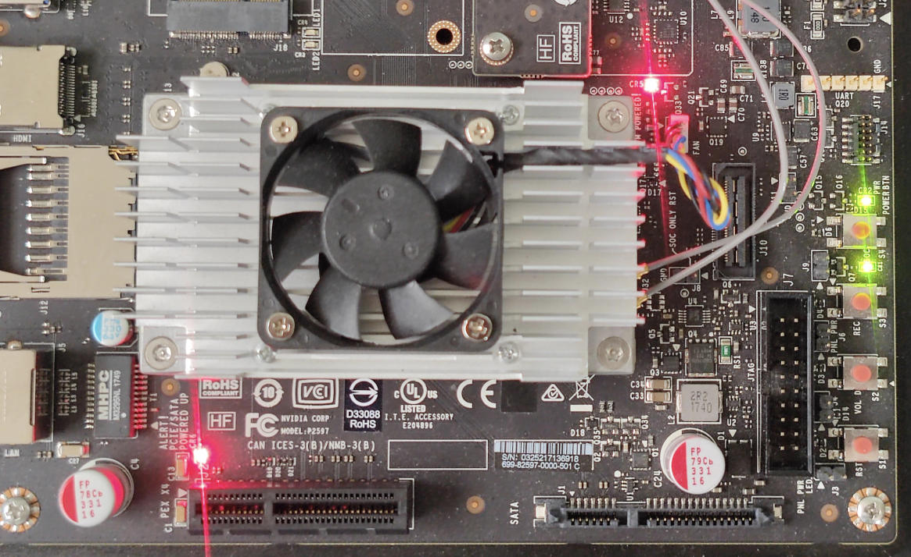

# MFET 642/442 Programming Robots with ROS -- The RallyCar Base Software


A top-down view of the rallycar with an illustration of components.

## Included components
The package includes the low-level hardware interface, as well as utilities that help developers to build and load maps and race lines.

### Hardware interface
The hardware interface is started with the `launch/rallycar_hardware.launch` launch file. The hardware interface is realized through the standard `rosserial` package. Specifically, on the client side, we use an Arduino as the aggregator of the low-level motor drivers and an IMU sensor. The code on the Arduino is provided in the `firmware` folder as a reference. Students are not required to understand or modify the firmware. By configuring the Arduino with the `rosserial` library, the server side (onboard computer) can convert the serial communication contents to and from ROS messages directly. This is achieved using the `rosserial_python` package.

The hardware interface is subscribing to the following topics that drive the car:
- `/accelerator_cmd` :arrow_left: throttle commands with `std_msgs/Float32` message type. The effective data range is $-2048.0$ to $2048.0$. Out-of-range values will be cropped to the nearest value. A positive value means driving the car forward. $2048.0$ corresponds to full throttle. A value around $170$ ~ $210$ will make the car start to move. From a broad observation, the throttle dead zone is about $180.0$, with about $15.0$ hysteresis. A negative value will put the car in reverse.
- `/steering_cmd` :arrow_left: steering commands with `std_msgs/Float32` message type. The effective data range is $-2048.0$ to $2048.0$. Out-of-range values will be cropped to the nearest value. $2048.0$ indicates full *left* steering, and $-2048.0$ indicates full right steering. The steering angle on the front wheel is about $50^{\circ}$ (or $100^{\circ}$ end-to-end). A steering command around $\pm1000.0$ gives a turning radius of about $1$ meter.

The throttle and steering commands are processed at $100$ Hz max frequency. Usually, a $50$ Hz frequency is enough.

The launch file starts a static transformation publisher that gives the frames of sensor measurements and their rigid transformations:
- `/tf_static` :arrow_right: static transformations describing transformations from the base link of the car to onboard sensor reference frames. The frames are defined in `urdf/rallycar.urdf`.

The hardware interface publishes measurements of an onboard IMU sensor. Due to the memory limitations of the Arduino, the IMU data is transmitted in segments (`/imu/accelerometer`, `/imu/gyroscope`, `/imu/orientation`, and `/imu/stamp`. Students, please ignore these four topics, as you should *never* subscribe to them directly). An `imu_parser` node is started alongside to aggregate these segments and publishes:
- `/imu` :arrow_right: aggregated IMU measurements with `sensor_msgs/Imu` message type. The topic provides full orientation, linear acceleration, and angular velocity measurements at $100$ Hz. The sensor frame is `imu_frame`. The orientation is relative to where the measurement starts (i.e. where the `rallycar_hardware.launch` is launched). Gravitational acceleration is not removed.

The launch file also starts the Hokuyo UST-10LX 2-D LiDAR driver. The driver publishes at:
- `/scan` :arrow_right: 2-D laser scans of the surroundings. The 1080 laser beams span 270 degrees, from right to left. The distance measurements of these beams refresh at $40$ Hz. The max range is 10 meters. The sensor frame is `laser`.
Optionally, a launch file for Intel RealSense cameras is provided at `launch/include/realsense.launch`. Students who are interested in image processing can include this file in the `rallycar_hardware.launch`.

### Path Server and Recorder
The path server and recorder (`scripts/path_server.py`) manage user interaction with waypoints in the map. The code has two working modes, that are set through its `mode` parameter.

In `record` mode, it works with the RViz visualization tool to record a user-issued sequence of 2D Nav goals. It then creates or overwrites the file (specified with `file_name` parameter) upon exit, if the user's input is non-empty. The recorded file on disk is a list of `geometry_msgs/Pose` structures in `YAML` format.

In `publish` mode, the node reads the file specified by the `file_name` parameter and processes it with a `YAML` parser. The loaded data is then further parsed as a `nav_msgs/Path` message type, containing *all* points within the specified file. The message is published at the `/desired_path` topic. The publisher is latched, which means every connecting node will receive this message exactly once.

### Keyboard teleoperation script
The `scripts/rally_keyboard_teleop.py` script listens on keyboard input in a terminal window at $10$ Hz, and publishes to the `/accelerator_cmd` and `/steering_cmd` topics. The values published to these topics depend on the last key pressed. In general, use the circle of keys `i`, `u`, `j`, `m`, `,`, `.`,`l`, and `o` (case sensitive) to send constant directional speed and steering combinations relative to key `k`. If key `k` or other non-mapped keys are pressed, the command will be set to $(0,0)$. Use `w`/`x`, `e`/`c`, and `q`/`z` to control the magnitude of command components for acceleration, steering, or both. Refer to screen output for instantaneous help.

When using the key combos to adjust the command magnitude, be aware that they are changed by scaling, so it may start small, but get big **exponentially**.

### RViz tool plugin to help build a path with a given map
In the `src` folder we provide a plugin for RViz that works with the path server in recording mode, to help the user create their path intuitively. In RViz, you can see a bunch of tools, such as `Interact`, `Move Camera`, etc. Towards the right, you can see a purple arrow icon with the name `2D Nav Goal`. Activate the tool with the shortcut key `g` or by clicking on the icon. Press `g` again, or press `esc` to exit the tool. With a fixed frame set to `map` on the right panel and a map visualization layer loaded, you can then click, drag, and drop your target pose on the map. The click represents the position of the goal pose, and the drag direction specifies the frontal orientation. With the path server started in `record` mode, this goal pose will be recorded sequentially, and published under the `/desired_path` topic as a `nav_msgs/Path` message.

In case you mistakenly picked a goal pose and want to delete it, activate the `RemoveLastNavGoal` tool by either clicking on the icon or using the shortcut key `d`. With the tool activated, you can use the key `delete` or key `backspace` to sequentially remove the last pose in the recorded sequence. The updated path will be reflected in the `/desired_path` topic as a `nav_msgs/Path` message.

This plugin is meant to be used with the path server in this package, and with the `resources/rviz_configs/build_path.rviz` RViz configuration.


The RViz loaded with the plugin to record and visualize user-clicked sequence of poses as a trajectory.

## Provided launch file snippets
- `rallycar_hardware.launch`: brings up rallycar hardware -- motor driver, LiDAR scanner, and static transforms defined by the URDF of the robot.
- `build_map.launch`: builds new map using `hector_mapping` in a no-wheel-odometer setup. To save the map to the disk when finished, the user needs to execute (provide your actual map name):
    ```sh
    rosrun map_server map_saver -f ${MY_MAP_NAME}
    ```
- `build_path.launch`: builds a new path with the provided map file and the path name. It starts the path server in `record` mode, loads the map, and starts an RViz instance for user interaction. Please modify this file to point to the corrent file name you wish to save your trajectory with.
- `load_map.launch`: snippet that loads the specified map file using `map_server`, which publishes the map under the `/map` topic. Please modify this file to point to the correct map file you wish to load.
- `load_path.launch`: snippet that loads the specified path file using the path server under `publish` mode. It publishes the path under the `/desired_path` topic. Please modify this file to point to the correct trajectory you wish to load.

## Operating Procedure

1. Connect the electronics battery (Li-ion) to the upper deck plug. The upper deck electronics should receive power now and you will be able to hear the LiDAR spinning up. Press the `POWER BTN` button on the Nvidia board to power up the computer (fourth button starting from the corner). You should see an LED lit up on the IMU circuit board at the front of the car when the system is booted.

2. The cars automatically connect to the `ROSlab` WiFi that the instructor sets up. To remotely connect to your car, you need to be on the same WiFi. Log into your car with the user name `nvidia`:
    ```sh
    ssh nvidia@car-X.local
    ```
    where 'X' is your car number as painted on the rear left corner of the upper deck. When asked for the password, enter `nvidia`. The password will **not** show up.

    You can also log in with `ssh nvidia@192.168.43.2XX`, where XX is the zero-padded car number. For example, `192.168.43.202` for car 2.

    You can perform code development when the lower deck is not powered.

3. Alternatively, you can open a remote desktop view of your car computer with [VNC Viewer (on Windows)](https://www.realvnc.com/en/connect/download/viewer/), [Remmina (on Linux)](https://remmina.org/how-to-install-remmina/#ubuntu), or the built-in VNC client (on Mac). For the address, enter `car-X.local` or `192.168.43.2XX` (remember to replace X with your car number) in the previous step. The VNC password is `nvidia`.

4. Turn on your remote control (RC) by toggling the switch on the rear of the remote to the right. A solid green LED should light up on the side of the remote.

5. Connect the motor battery (Ni-MH) to the blue Electronic Speed Controller (ESC) on the lower deck. Press the button on the ESC to power it up. You should see a solid green LED on the ESC, as well as on the radio receiver (a smaller cube further inside the lower deck of the car).

**NOTE**: Before proceeding, please check that there is NO blinking LEDs on the car at this step.

6. Put your car on a safe stand, or put it on a solid flat ground without moving it. You can start your code now. At code startup, the IMU will calibrate itself for up to six seconds. This means if you are using the IMU measurements, you need to place the car on a stationary flat surface and do not move the car **before** you launch anything containing `rallycar_hardware.launch`, and do not touch the car after the code startup. Wait until the `L` LED and the `TX` LED on the Arduino light up (it may take up to six seconds). Now you are safe to move the car (either by carrying it or by itself).

7. When you have finished, power down the ESC by pressing the button on the ESC for 2 seconds. Power down the onboard computer through the graphical desktop, or by the command:
    ```sh
    sudo poweroff
    ```
    Finally, **do not forget to unplug the Li-ion battery** to the upper deck **and turn off the remote**.

## The onboard computer and system environments


A top-down view of the Jetson TX2.

We provide NVIDIA Jetson TX2 single-board computers as the onboard processing hardware of our 2nd-generation rallycars (since 2017). The computer has a 6-core ARM64 processor and a Pascal generation 256-core GPU, CUDA compatible. The onboard computer has 8GB of memory and 32GB of storage. After OS and ROS installation, the amount of free storage onboard is about 12 GB.

Although NVIDIA officially dropped support for this device in 2020, and the official OS images stayed at Ubuntu 18.04, we managed to upgrade it to Ubuntu 20.04 and passed functional checks. This unofficial upgrade brings us huge benefits in using ROS noetic out-of-the-box since noetic is the first ROS version that migrated to Python 3.

We also packed our TX2 with more useful libraries. We have included CUDA 8.0, TensorRT 8.2.1.8, and OpenCV 4.2 with CUDA support in the OS. Specifically, the OpenCV version is chosen based on native ROS noetic support and compiled from source to add CUDA-based accelerations. We have also included a community edition of Docker in case any students want to explore ROS2 on this system.

As we are moving on, a Next-Generation of rallycar is emerging based on ROS2, powered by the new NVIDIA Orin Nano single-board computer. The Orin Nano has a similar 6-core, 8GB RAM configuration, but has a more powerful GPU (1024-core NVIDIA Ampere generation with 32 Tensor Cores). This configuration allows more developments in edge image processing and edge AI to be added in the future. The Orin Nano comes with Ubuntu 22.04 OS, which means ROS1 software has to now run in containers or [compiled from source](https://gist.github.com/HaoguangYang/b7e5d4b333a40dcb9afc59db13359aea). However, the new OS has native support for ROS2 Humble, an active long-term-support version of ROS2.

## How to use the remote control



A diagram of the remote control, powered on and operational.

### Remote control as a deadman switch
To prevent the car from losing control, multiple safety features are implemented on the hardware. Since the car will drive itself, we no longer need the remote to steer the car. However, we repurpose the remote control as a safety mechanism known as the "deadman switch". To keep the car moving, the deadman switch must be online and set. For our remote, to activate the driving motor on the car, we need to:

- pair it to the car,
- power it on, and
- turn the "trim" knob above the middle point.

Missing any one of the three conditions will disable the driving motor. Furthermore, the travel of the "trim" knob will act as a limiter to the maximum percentage of power applied to the driving motor.

**NOTE**: Do NOT touch the steering wheel, as with the current design it will interfere with the "trim" knob.

### Pairing the remote with the car
If your **radio receiver** on the car has a fast-blinking (~3Hz) red LED when turned on, and your remote control is on with a solid green LED, you need to pair your remote with the car. To perform pairing:

1. First make sure the ESC is off. Press and hold the pairing button on the radio receiver, and turn on the ESC **with the pairing button remaining pressed**. You should see the red LED on the receiver slowly (~1Hz) blinking red, indicating the pairing mode.

2. On your remote, first make sure the battery is operational on the remote, and the remote is powered off. Press and hold the `SET` button on the top, and turn on the remote with the `SET` button remaining pressed. You should see both the remote and the radio receiver have solid green LEDs lit.

### Changing the battery of the remote
The remote uses 4xAA batteries. If the LED on the remote turns red and blinks fast (~3Hz), you need to replace the batteries. The battery compartment is at the bottom of the remote.

**Remember to turn off the remote after each test!**

## Battery notes
We use two battery packs for each car: the power battery for the lower deck (NiMH 6S 7.2V or NiMH 7S 8.4V), and the electronics battery for the upper deck (Lithium-ion 3S 11.1V). The power battery is connected directly to the ESC module at the lower deck, and the electronics battery is connected to the battery protection board on the upper deck. The connectors are both TRX 2-pin plugs. When connecting, please ideltify the polarity by the red wire.

The discharge of the power battery is managed by the ESC. If your ESC is flashing red LED and refuses to turn on the driving motor, you should consider recharging the power battery.

The electronic battery, however, requires more careful handling for discharge. As a Li-ion battery, its lifespan can be significantly damaged by overdischarging or overcharging. As a result, our battery protection boards have set a 10.0V hard-cutoff voltage (all upper deck electronics will be forced power-off as the Lithium battery drops below 10V). These Lithium batteries have a fully-charged voltage of 12.6V, and their discharge curve is relatively shallow in the range of 11.4V to 10.8V. This means their output voltage will quickly drop once leaving this region. On daily operations, you should consider recharging them as soon as the voltage drops below 11V, and use the "Balance" mode (default) on the charger.

To check the output voltage of the electronic battery, you can refer to the default display on the battery protection board, shown as below:



An illustration of the battery protection board. Students, please do not touch the two buttons on the PCB.

Alternatively, as some of the cars have this board mounted beneath the upper deck, making it hard to read, you can check the readout on the DC-DC boost converter. Please press the button on the converter, such that the "IN" LED (or the LED closer to the "IN" side) is lit. The numbers on the digital display then corresponds to the battery voltage. Alternatively, you can toggle the button and read the lower of the two numbers as the battery voltage.



An illustration of the DC-DC boost converter board, and the button/LED to distinguish.

**Remember to unplug all batteries when you finish testing!**

## Troubleshooting

1. My car will not move despite I publish the command on the onboard computer.
    - make sure your ESC and the remote have sufficient battery power. A slow-blinking red LED on the ESC indicates a low voltage on the motor battery.
    - Verify that your remote (deadman switch) has sufficient batteries, and is paired to the radio receiver. Gently depress the deadman switch trigger.
    - Verify that you are publishing a proper value to `/accelerator_cmd` topic with message type `std_msgs/Float32` at at least 1Hz frequency, and verify `rallycar_driver` is one of the subscribers.
    - *Post-crash, Instructor permission* Check cable harness -- the deadman switch is the signal pin (pin 1) of slot 3 on the radio receiver. The other end of the cable is attached to pin 2 of the Arduino.
    - *Post-crash, Instructor permission* Check cable harness -- the PWM output to the driving motor is pin 7 of the Arduino. It should be connected to the white wire from the ESC. The other pin on that connector should connect the ground of the ESC to the ground of the Arduino.

2. My car will not steer despite I publish the command on the onboard computer.
    - Verify that you are publishing a proper value to `/steering_cmd` topic with message type `std_msgs/Float32`, and verify `rallycar_driver` is one of the subscribers.
    - *Post-crash, Instructor permission* Check cable harness -- the PWM output to the driving motor is pin 6 of the Arduino. It should be connected to the white wire from the steering servo motor. The other pin on that connector should connect the ground of the steering servo motor to the ground of the Arduino.

3. My onboard computer will not turn on.
    - Verify the DC-DC boost module is on and providing at least 12.5V output. Otherwise, consider charging your upper deck battery.
    - Verify the power connector to the onboard computer is properly connected.
    
    This is what a powered-on Jetson TX2 onboard computer looks like.

4. I cannot connect to my onboard computer.
    - Please ensure you are on the `ROSlab` WiFi, the same network the onboard computer will connect to. Try ping-ing the onboard computer when connected to the `ROSlab` WiFi.
    - If you need physical access to the screen, a recommended way is to use a 270-degree HDMI connector to reduce strain on the cable.
    - *At your own risk* Alternatively, you can set up your network switch with subnet `192.168.0.0/24` and avoid other devices using `192.168.0.1`. Unplug the LiDAR from the onboard computer and plug it into the switch. Then, plug the onboard computer into the switch with an Ethernet cable. You should be able to connect to the onboard computer at `192.168.0.1`.

5. My VNC screen freezes when an external monitor is not connected.
    - Please `ssh` into the computer and edit the file with `sudo`:
        ```sh
        sudo nano /etc/X11/xorg.conf
        ```
      Follow the text comments, comment out line 21, and uncomment line 23. Press `Ctrl-X` to save and exit. Then run:
        ```sh
        sudo service gdm3 restart
        ```
      **Note:** You need to revert this modification (see below) to connect to a physical monitor.

6. My external HDMI monitor is showing a black screen.
    - Please `ssh` into the computer and edit the file with `sudo`:
        ```sh
        sudo nano /etc/X11/xorg.conf
        ```
      Follow the text comments, comment out line 23, and uncomment line 21. Press `Ctrl-X` to save and exit. Then run:
        ```sh
        sudo service gdm3 restart
        ```
      **Note:** You need to revert this modification (see above) to use the VNC connection without an HDMI spoofer plug.

7. My LiDAR is not connecting.
    - Check your launch file for a proper LiDAR IP address (`192.168.0.10`). If you are using this base software, it should be in `launch/include/laser.launch`.
    - Check network interfaces on the onboard computer:
        ```sh
        ifconfig
        ```
      Among the results, please confirm your `eth0` interface is active and has an IP address `192.168.0.1`. If not, make `eth0` online through the graphical desktop or the command line.
    - Try to ping the LiDAR at `192.168.0.10`. If it replies, your LiDAR is broken. Please seek help from the instructors.
    - If your LiDAR does not reply and your `eth0` is online, your LiDAR may still be somewhere in the network. To find it, do:
        ```sh
        sudo tcpdump -i eth0 port 10940
        ```
      You will see in the output, something like:
        ```sh
        12:46:24.835043 IP 128.46.112.200.10940 > 239.255.0.1.10940: UDP, length 131
        ```
      In the packets, The first IP indicates the current IP of the LiDAR. You can then migrate the LiDAR to the `192.168.0.10` IP:
        ```sh
        rosrun urg_node set_urg_ip.py 192.168.0.10 192.168.0.1 --nm 255.255.255.0 --ip $LIDAR_IP_YOU_HAVE_FOUND
        ```
      Power-cycle the entire upper deck to make changes take effect.

If none of the above resolves your issue, please consult the instructors.
